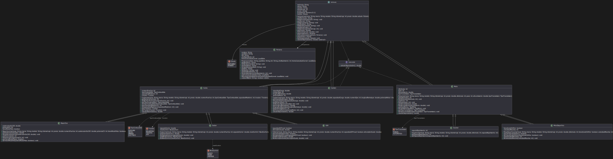

# UT5_ED_Prog

## Checklist de tareas

- [x] Crear repositorio GitHub.
- [x] Añadir README.md con checklist.
- [x] Crear carpeta `uml/`.
- [x] Crear archivo `.puml` por cada clase detectada (estructura inicial).
- [x] Primer commit con la estructura base y subida al remoto.
- [x] Modelar progresivamente atributos en los archivos '.puml'.
- [x] Modelar progresivamente métodos en los archivos '.puml'.
- [x] Modelar las relaciones entre clases en los archivos '.puml'.
- [x] Generar el diagrama UML en formato '.svg' con PlantUML.
- [x] Insertar el diagrama en el 'README.md'.
- [x] Commit final con todos los cambios y subida al remoto.

